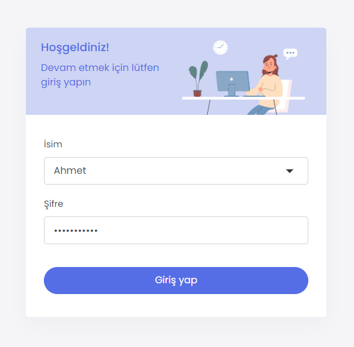

# Redis Chat App

Redis chat application demo using React, Node.js and Socket.io

## Screenshots

|                                |                                                |                                                |
| :--------------------------------------------------------------------------------------------------------------------------------------------------------------------------: | :---------------------------------------------------------------------------------------------------------------------------------------------------------------------: | :---------------------------------------------------------------------------------------------------------------------------------------------------------------------: |
|  |  |  |  |

## Before Start

```
# Make sure docker daemon runs in your local
# Change .env.example files to -> .env
```

## Quick Start

```
# Build and run in Docker:
* docker-compose up

# Tear down
* docker-compose down

# To re-build
* docker-compose build

---------------------------

# If you want to run without Docker:

1- Run redis server in your local with default port number: '6379'

2- Change this file in /server -> REDIS_ENDPOINT_URL = "redis://redis:6379"
to this -> "redis://localhost:6379"

3- Change package.json file in /client -> "proxy": "http://node-server:4000"
to this -> "http://localhost:4000"

4- In project root directory run these commands:

* cd server
* yarn start

* cd client
* yarn start

# Api docs can be reached at:
http://localhost:4000/docs/

```

## Outcomes

* Auth flow analysis and basic jwt auth implementation to make secure api calls.
* Refactoring existing codebase using the principles of seperation of concerns
* System design analysis (redis commands, pub/sub, events and socket.io implementation)

## Sources

* <https://github.com/redis-developer/basic-redis-chat-app-demo-nodejs>
* <https://docs.docker.com/get-started/>
* <https://redis.io/docs/getting-started/>

## License

MIT License
